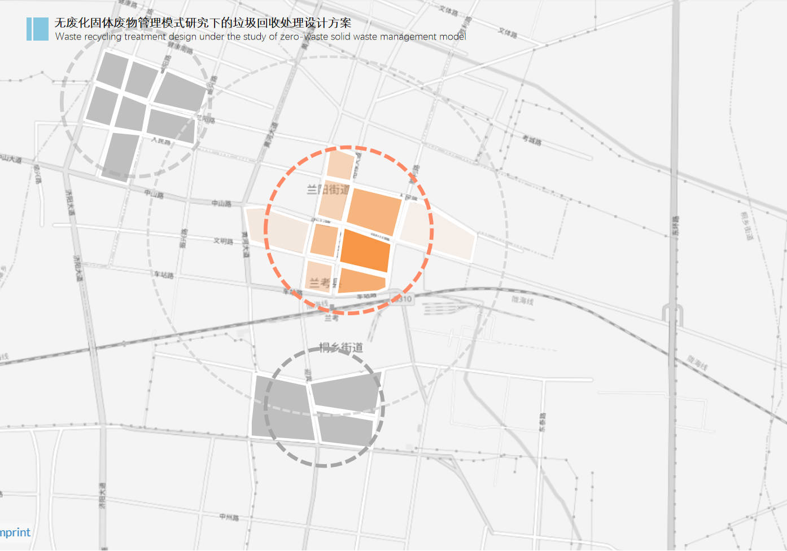

## Introduction

The "zero waste concept" developed in the United States in the 1970s. A trash disposal company was processing electronic chemicals to increase the reuse rate of things and raw materials while avoiding waste formation, which would result in the waste of a significant quantity of land resources. After being proposed, the concept was initially used in the urban environmental management of Australia's capital, Canberra. Canberra was also the first to establish the objective of creating a "zero waste city" based on the "zero waste" concept. (Zhang, 2021).

## Rules

1. Work Plan for the Construction of" Zero Waste Cities "during the 14th Five Year Plan Period

2. Planning Standards for Urban Environmental Sanitation Facilities (GB/T50337-2018)

This standard includes land use rules for domestic trash transfer facilities, along with a methodology for calculating the production of urban domestic garbage.

**Land Use Rules:**

  
  

**Basic Equation for the Generation of Household Garbage in Urban Areas:**

The formula for calculating the maximum daily output of residential garbage (Q) is given by:

$$ Q = \frac{R \times C \times A}{1000} $$

- \( Q \) — The maximum daily output of residential garbage, measured in tonnes per day (t/d).
- \( R \) — Denotes the planned population, measured in persons.
- \( C \) — The predicted average daily domestic waste production per capita, which ranges from 0.8 kg/person·day to 1.4 kg/person·day.
- \( A \) — Coefficient of irregular daily output of domestic trash, which may range from 1 to 1.5.
	

## Project Target

  

## Collection site Model

  

### Sketch renderings

  

  

  

### Tec-based Plan
**Broken Bag Scanning**
- \( Step1 \) — Scan the owner's card/login at ①, the garbage bin door opens 
- \( Step2 \) —  Put the garbage into the garbage identification area ② by breaking the bag or using a transparent colorless bag 
- \( Step3 \) —  Scanning by the camera, such as scanning and identifying more than 70% of the garbage as qualified, the baffle plate opens/falls down, and the garbage falls into the storage area ③, and the residents are qualified to put in the garbage. If it is lower than 70%, it will still fall into the bucket, but the system will record the input user as unqualified input behavior. （Step 4: The staff withdraws the garbage cans from ③ and replaces them with the garbage cans that have been washed at the transfer station.

  

**Multiple login and drop-off methods (NFC, face swipe, account password)**
- There is an NFC swipe card induction area on each drop-off port. During the time of garbage drop-off, just approach the garbage room, and the swipe card induction drop-off port will be opened automatically. When the garbage is finished, the opening will be closed automatically. If you forget to bring the access card can also be in front of the garbage room screen to brush your face, use the account password to select the category of garbage cans to open the lid. The garbage room is connected to the community property system and can be linked to the owner's account number after logging in.

## Collection Program

  

### Transfer station setup

  

- The city LanKao is covered by concentric circles with a radius of ≤3km, and a community waste transfer station is set up at the center of the circle, and the garbage in the smart garbage rooms of the districts covered by the concentric circles is transported to the corresponding transfer station for sorting and recycling.

- If multiple concentric circles intersect, the intersecting part will be retained only in one of the concentric circles, and the collection area of the remaining concentric circles will be supplemented by the uncovered marginal areas.
  

  

- \( 1 \) — **Transfer station to the end of the recycling line**. According to the satellite map measurement, Lankao County urban area is 41.2 square kilometers.Taking Bianlan Avenue-Zhongshan Avenue, the central road running through the east and west of the city, as the boundary, the city is divided into north and south zones, and all the transfer station garbage to garbage recycling company in a/b zone is taken care of by a group of cars.
- \( 2 \) —**Recycling time from transfer station to waste factory** The recycling time and frequency of food waste, other waste and hazardous waste from transfer station to docking garbage treatment plant are fixed; the rest of the waste is set up according to the peak of waste recycling volume with a waste capacity threshold - i.e., the volume of garbage transferred from intelligent garbage room to transfer station is more than 2/3 of the volume of waste in the transfer station. The remaining waste is set at a capacity threshold based on the peaks of the recycling volume - i.e. the volume of waste transferred from the Smart Waste Room to the transfer station exceeds 2/3 of the transfer station's capacity.The waste recycling volume trough can be set as when ≥20% of the waste bins have not been changed at the transfer station for more than 30 days, this category of waste needs to be flexibly adjusted to other recycling categories.
- 
## Zero-waste city cells

  

### the End

  

